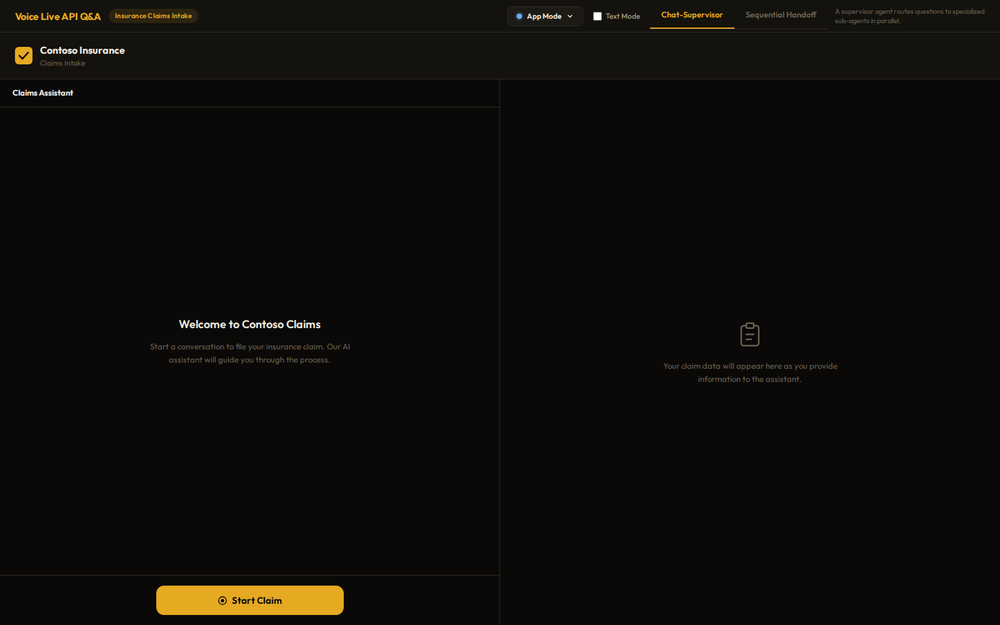
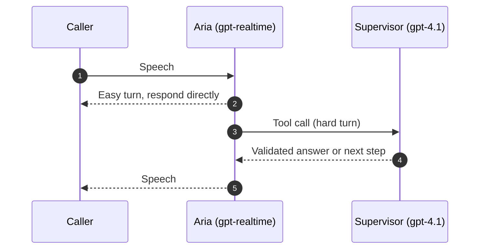
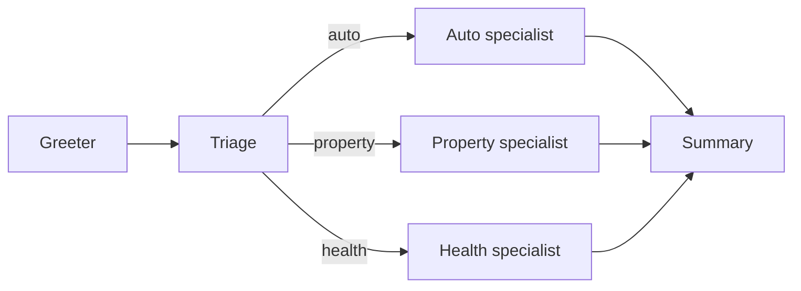
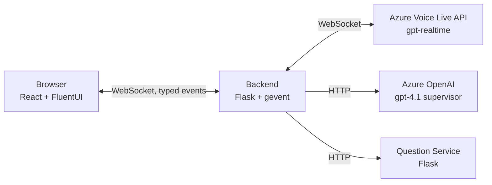

<div align="center">

# Voice Live API — Orchestration Patterns

Two voice-agent patterns on Azure AI Voice Live API, in Python, with the orchestration moves made visible in the UI.

[](https://learn.microsoft.com/azure/ai-services/speech-service/)
[](https://python.org)
[](https://react.dev)
[](#evaluation-framework)
[](LICENSE.md)

<a href="docs/static/img/02-app-mode-initial.png">
  
</a>

</div>

---

A working sample that builds two voice agent patterns — **Chat-Supervisor** and **Sequential Handoff** — on top of the Azure AI Voice Live API, using `gpt-realtime` for the conversation and `gpt-4.1` as the text supervisor. The reference scenario is an insurance claims intake call. Both patterns originate from [`openai/openai-realtime-agents`](https://github.com/openai/openai-realtime-agents); this repo ports them to Azure, in Python, with the orchestration moves made visible in the UI.

If you only want the story (screenshots, sequence diagrams, code links), jump to the [documentation site](#documentation-site).

## Contents

- [What is in here](#what-is-in-here)
- [The two patterns](#the-two-patterns)
- [Architecture](#architecture)
- [Getting started](#getting-started)
- [Configuration](#configuration)
- [Evaluation framework](#evaluation-framework)
- [Customization](#customization)
- [Project structure](#project-structure)
- [Documentation site](#documentation-site)
- [License](#license)

## What is in here

| Piece | What it does |
|---|---|
| **Two orchestration patterns** | Chat-Supervisor (one realtime agent + a text supervisor) and Sequential Handoff (six specialist agents handing off via tool calls). |
| **Server-mediated topology** | The browser never talks to Azure directly. The Python backend holds credentials, mediates the WebSocket, and emits its own typed events. |
| **Question / validation service** | A separate Flask service models the "domain backend" you would replace with your CRM, policy admin, or EHR. |
| **App + Developer UI** | A polished caller view *and* a developer view with transcript, event timeline, prompt diff, and call summary — both rendered from the same WS stream. |
| **Eval harness** | Crawl / Walk / Run methodology — synthetic TTS, noisy audio, multi-turn user simulation. Grades against tool calls, transcripts, and an LLM rubric. |
| **Keyless auth** | `DefaultAzureCredential` end-to-end. Works with `az login`, managed identity, GitHub OIDC. |

## The two patterns

### Chat-Supervisor

One realtime voice agent (`Aria`) carries the conversation. When she hits something that needs more thought — validating an ambiguous answer, judging completeness, picking a branch — she calls a tool that routes the question to a text model (`gpt-4.1`). The supervisor's reply comes back as the tool result, and Aria says it.

The trade is latency for intelligence on the hard moments only. The realtime model stays cheap and fast; the supervisor only burns tokens when called.



### Sequential Handoff

A small graph of specialists: a greeter, a top-level Q&A agent that figures out the claim type, three claim specialists (auto, property, health), and a summary agent. Each one has its own prompt and a `transfer_to_<other>` tool. When the model calls a transfer, the backend issues a `session.update` with the new prompt and tools — same Voice Live session, different agent.

Useful when one big prompt would be brittle and you would rather have small focused ones.



For the why and the trade-offs, the upstream README is still the best read: [`openai/openai-realtime-agents`](https://github.com/openai/openai-realtime-agents).

## Architecture



The backend is the only thing that speaks to Azure. The frontend subscribes to a typed event stream that drives both the user-facing UI and the developer view.

## Getting started

### Prerequisites

- Python 3.11+
- Node.js 20+
- Azure subscription with:
  - Azure AI Services (for Voice Live API)
  - Azure OpenAI with deployed models:
    - `gpt-4o-realtime-preview` (voice model — `gpt-realtime` series, API version `2025-08-28`)
    - `gpt-4.1` (text supervisor model)

### Local development

```bash
# 1. Clone and configure
git clone https://github.com/aymenfurter/voicelive-agent-patterns.git
cd voicelive-agent-patterns
cp .env.template .env
# Edit .env with your Azure resource details

# 2. Authenticate (no API keys needed; uses DefaultAzureCredential)
az login

# 3. Install
pip install -r backend/requirements.txt
pip install -r question-service/requirements.txt
(cd frontend && npm install)
```

Run the three services in separate terminals:

| Terminal | Command |
|---|---|
| Question service | `cd question-service && flask run --port 8001` |
| Backend | `cd backend && flask run --port 8000` |
| Frontend | `cd frontend && npm run dev` |

Then open http://localhost:5173.

> Your Azure account needs the **Cognitive Services OpenAI User** role on the AI Services resource.

### Docker

```bash
docker build -t voice-live-qa .
docker run --env-file .env -p 8000:8000 -p 8001:8001 voice-live-qa
```

### Azure deployment

Using [`azd`](https://learn.microsoft.com/azure/developer/azure-developer-cli/):

```bash
azd auth login
azd up
```

Or Bicep directly:

```bash
az deployment group create \
  --resource-group <rg-name> \
  --template-file infra/main.bicep \
  --parameters @infra/main.parameters.json \
  --parameters backendImage=<registry>/voicelive-qa-backend:<tag> \
  --parameters questionServiceImage=<registry>/voicelive-qa-question-service:<tag>
```

## Configuration

See [`.env.template`](.env.template) for the full list.

| Variable | Description |
|---|---|
| `AZURE_VOICE_ENDPOINT` | Azure AI Services endpoint, e.g. `https://<resource>.cognitiveservices.azure.com` |
| `AZURE_OPENAI_ENDPOINT` | Azure OpenAI endpoint |
| `AZURE_OPENAI_DEPLOYMENT` | Realtime model deployment name (e.g. `gpt-4o-realtime-preview`) |
| `AZURE_OPENAI_TEXT_DEPLOYMENT` | Text supervisor deployment name (e.g. `gpt-4.1`) |
| `QUESTION_SERVICE_URL` | Question service URL (default `http://localhost:8001`) |
| `VOICE_NAME` | TTS voice (default `en-US-Aria:DragonHDLatestNeural`) |

`AZURE_VOICE_API_KEY` and `AZURE_OPENAI_API_KEY` are optional — `DefaultAzureCredential` is the default path.

## Evaluation framework

295 tests built on the **Crawl / Walk / Run** methodology from the [OpenAI Realtime Eval Guide](https://developers.openai.com/cookbook/examples/realtime_eval_guide). Full methodology in [`evals/README.md`](evals/README.md).

### The 2x2 evaluation quadrant

| | Synthetic / clean input | Real / noisy input |
|---|---|---|
| **Single turn** | **Crawl harness** — synthetic TTS feeding the Voice API | **Walk harness** — same, with noise overlay and bandwidth degradation |
| **Multi turn** | **Run harness** — `gpt-4.1` user simulator driving full episodes | Manual testing — real users in production |

### Test tiers

| Tier | Directory | Tests | What it tests | Azure required |
|---|---|---|---|---|
| Unit | `evals/unit/` | 118 | Question data, validator logic, pattern configs | No |
| Integration | `evals/integration/` | 77 | Golden dataset validation, conversation flow completeness | No |
| Simulation | `evals/simulation/` | 39 | Text-simulated conversations, bad-audio proxies | No |
| E2E | `evals/e2e/` | 26 | Live Voice API sessions via real backend | Yes |
| Crawl harness | `evals/harness/` | 4 | TTS to Voice API to tool call + LLM grading | Yes |
| Walk harness | `evals/harness/` | 20 | Crawl with 5 noise conditions (office, phone bandwidth, etc.) | Yes |
| Run harness | `evals/harness/` | 11 | Multi-turn episodes with `gpt-4.1` user simulator x 3 personas | Yes |

### Grading stack

| Layer | Type | What it checks |
|---|---|---|
| Deterministic | Exact match | Tool name called, argument values, JSON schema validity |
| Keyword | Substring match | Expected phrases in transcripts (e.g. "claim type", "policy number") |
| LLM rubric | `gpt-4.1` judge | Instruction following, conciseness, no hallucination, professional tone |

### Running evaluations

```bash
# Offline tiers (no Azure) — fast
pytest evals/unit/ evals/integration/ evals/simulation/

# Live tiers (require Azure)
pytest evals/harness/test_crawl.py        # ~2 min
pytest evals/harness/test_walk.py         # ~11 min
pytest evals/harness/test_run.py          # ~11 min per persona
pytest evals/e2e/                         # ~5 min

# Everything
pytest evals/
```

<details>
<summary><b>Audio pipeline (harness)</b></summary>

1. **Synthesize** — `edge-tts` produces MP3, `ffmpeg` converts to PCM16 24 kHz mono.
2. **Degrade** — Walk overlays office noise, narrows to phone bandwidth, lowers SNR; Run keeps clean audio but drives the conversation through a `gpt-4.1` user simulator.
3. **Stream** — 20 ms chunks pushed to a Voice Live session with VAD disabled and manual commit.
4. **Collect** — tool calls, transcript, audio deltas, latency.
5. **Grade** — deterministic + keyword + LLM rubric.

</details>

## Customization

### Modifying questions

Edit [`question-service/questions_data.py`](question-service/questions_data.py) to:

- Add or remove questions in any claim type section
- Modify branching conditions (e.g. "if answer contains X, skip to question Y")
- Add validation rules for expected answer formats
- Define new claim types (auto, property, health, or custom)

### Adding a new orchestration pattern

1. Create a new module in [`backend/patterns/`](backend/patterns/) (see [`chat_supervisor.py`](backend/patterns/chat_supervisor.py) or [`sequential_handoff.py`](backend/patterns/sequential_handoff.py)).
2. Implement session configuration and tool-call handling.
3. Register it in [`backend/patterns/registry.py`](backend/patterns/registry.py).
4. Add unit tests under [`evals/unit/`](evals/unit/).

### Changing the voice

Update `VOICE_NAME` in `.env`. See the [Azure TTS voice gallery](https://learn.microsoft.com/azure/ai-services/speech-service/language-support?tabs=tts). Default: `en-US-Aria:DragonHDLatestNeural`.

## Project structure

<details>
<summary>Click to expand</summary>

| Path | Purpose |
|---|---|
| [`backend/`](backend/) | Flask app on `:8000` — Voice Live WS proxy, supervisor calls, typed event stream |
| [`backend/patterns/`](backend/patterns/) | Orchestration patterns: `chat_supervisor.py`, `sequential_handoff.py`, shared `base.py` |
| [`backend/api/`](backend/api/) | REST endpoints (health, patterns, sessions) |
| [`question-service/`](question-service/) | Flask app on `:8001` — Q&A REST API and answer validator |
| [`frontend/`](frontend/) | React + Vite + FluentUI client (App and Developer mode) |
| [`evals/`](evals/) | Evaluation framework (295 tests) — unit, integration, simulation, e2e, harness |
| [`e2e/`](e2e/) | Playwright UI tests |
| [`infra/`](infra/) | Azure Bicep (Container Apps, managed identity, Log Analytics) |
| [`docs/`](docs/) | Hugo documentation site |
| [`Dockerfile`](Dockerfile) | Multi-stage production build |
| [`azure.yaml`](azure.yaml) | `azd` configuration |
| [`pyproject.toml`](pyproject.toml) | Python project + pytest config |
| [`.env.template`](.env.template) | Environment variable reference |

</details>

## Documentation site

A [Hugo](https://gohugo.io) site under [`docs/`](docs/) walks the whole sample with screenshots, sequence diagrams, and code references that link back to the file on GitHub. The pages cover:

- **Origins and lineage** — what is the same as `openai/openai-realtime-agents` and what changed.
- **Architecture** — the three processes and the gevent / asyncio bridge.
- **Session lifecycle** — why a handoff is a `session.update`, not a new session.
- **Chat-Supervisor and Sequential Handoff**, end to end.
- **Validation flow** — what happens when the caller is too vague.
- **Events and compaction** — the event taxonomy, which events flow on which pipe, the three compaction strategies.
- **App vs Developer mode** — same WS stream, two UIs.
- **Evals** — the Crawl / Walk / Run harness and how grading works.
- **Integration guide** — how to swap the question service for your own backend.

### Run it locally

```bash
cd docs
hugo server -p 4040
# then open http://localhost:4040
```

You need Hugo extended (`brew install hugo`, or grab a [release](https://github.com/gohugoio/hugo/releases)). The site reads source files through a `_code` symlink inside `docs/`, so build from the repo root.

### Publishing

The workflow at [`.github/workflows/docs.yml`](.github/workflows/docs.yml) builds the site and ships it to GitHub Pages on every push to `main` that touches `docs/`, `backend/`, `frontend/`, or `question-service/`. To turn it on, set Pages → Source to GitHub Actions in repo settings, then push.

## License

MIT — see [LICENSE.md](LICENSE.md).
